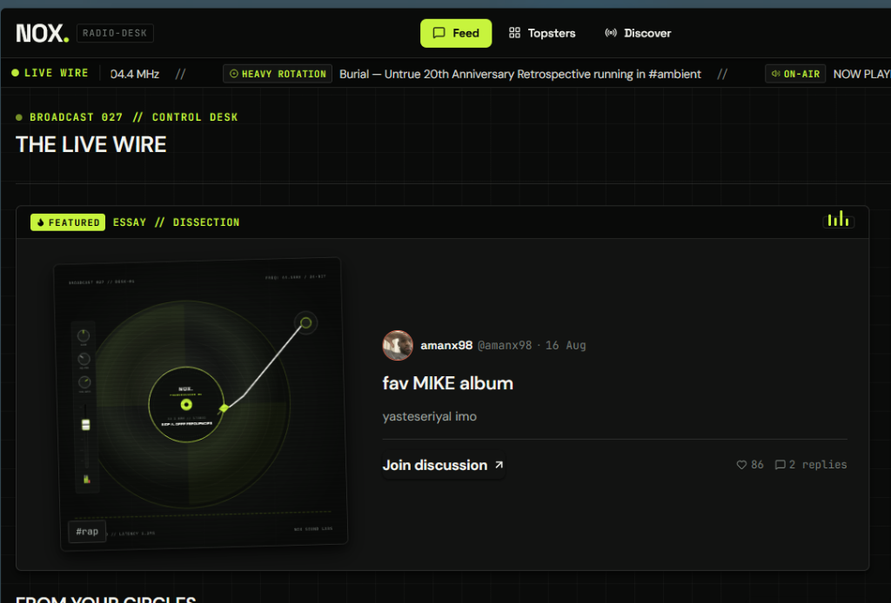
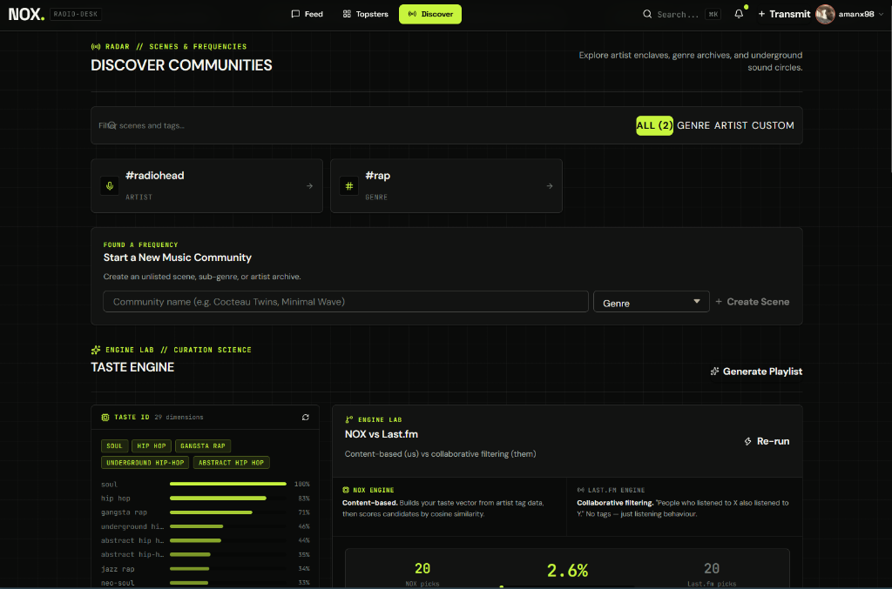
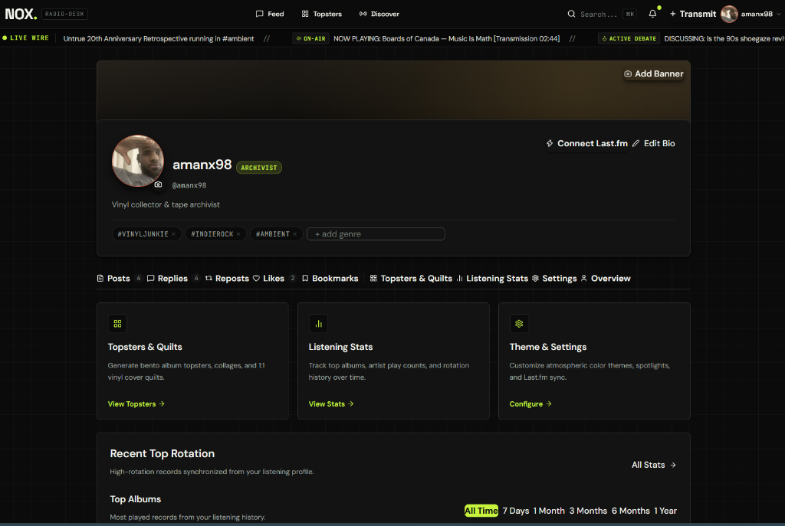
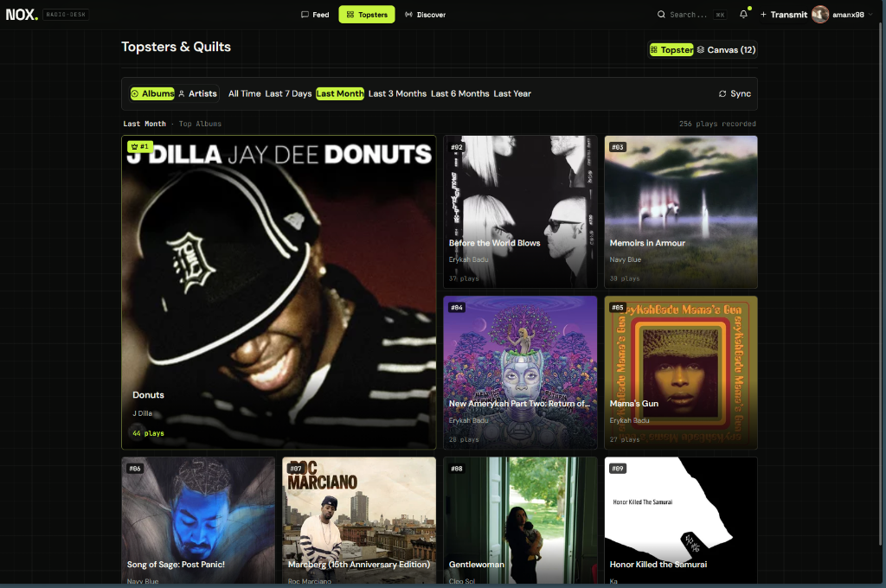

# Nox

A social platform for music fans — connect your Last.fm account, browse and post in artist/genre communities, and generate visual "album quilts" from your real listening data.

## Screenshots

<table>
  <tr>
    <td valign="top" width="50%">
      <b>Thread View</b><br/>
      
    </td>
    <td valign="top" width="50%">
      <b>Discover & Taste Engine</b><br/>
      
    </td>
  </tr>
  <tr>
    <td valign="top" width="50%">
      <b>User Profile</b><br/>
      
    </td>
    <td valign="top" width="50%">
      <b>Bento Grids & Quilts</b><br/>
      
    </td>
  </tr>
</table>

## Features

- **Auth** — JWT-based registration and login
- **Communities** — Reddit-style tags for artists and genres, with threaded discussions
- **Last.fm integration** — connect your account to pull real listening stats
- **Album quilts** — auto-generated grid collages of your top albums or top tracks, with custom time period and grid size
- **Top artists visual grid** — beautifully composed Bento grids of your top artists, powered by intelligent cross-platform photo matching (Deezer & TheAudioDB) that bypasses Last.fm's missing image limitations
- **Taste Engine (AI Curation)** — personalized track recommendations based on your listening history using genre and vector-based taste profiling
- **Audio Previews** — instantly listen to 30-second high-quality audio previews of recommended songs via Deezer

## Tech stack

**Backend:** FastAPI, PostgreSQL, SQLModel, Alembic, Pillow (image generation)
**Frontend:** React (Vite), React Router, Tailwind CSS, Framer Motion
**Auth:** JWT, bcrypt password hashing
**External APIs:** Last.fm, Deezer, TheAudioDB

## Getting started

### Backend

```bash
cd backend
python -m venv venv
source venv/Scripts/activate   # Windows (Git Bash) — use venv/bin/activate on Mac/Linux
pip install -r requirements.txt

cp .env.example .env
# fill in .env with your own database URL, secret key, and Last.fm API credentials
# get Last.fm API keys at https://www.last.fm/api/account/create

alembic upgrade head
uvicorn app.main:app --reload
```

Backend runs at `http://127.0.0.1:8000` — interactive API docs at `http://127.0.0.1:8000/docs`.

### Frontend

```bash
cd frontend
npm install
npm run dev
```

Frontend runs at `http://localhost:5173`.

### Database

Requires PostgreSQL running locally. Easiest via Docker:

```bash
docker run --name music-app-db -e POSTGRES_PASSWORD=yourpassword -e POSTGRES_DB=musicapp -p 5432:5432 -d postgres
```

## Roadmap

- [ ] Spotify integration (pending developer account access)
- [ ] Auto-generate quilts on a schedule
- [x] Top artists as a visual grid (solved via Deezer/TheAudioDB API fallback and track-anchor correlation)

## License

MIT
